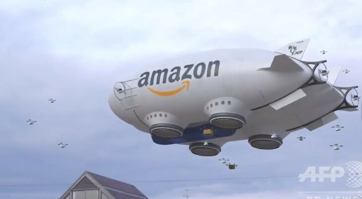
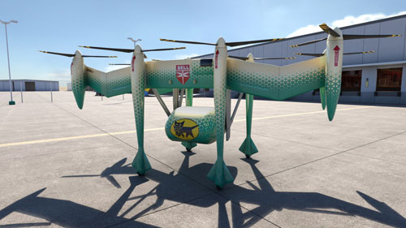
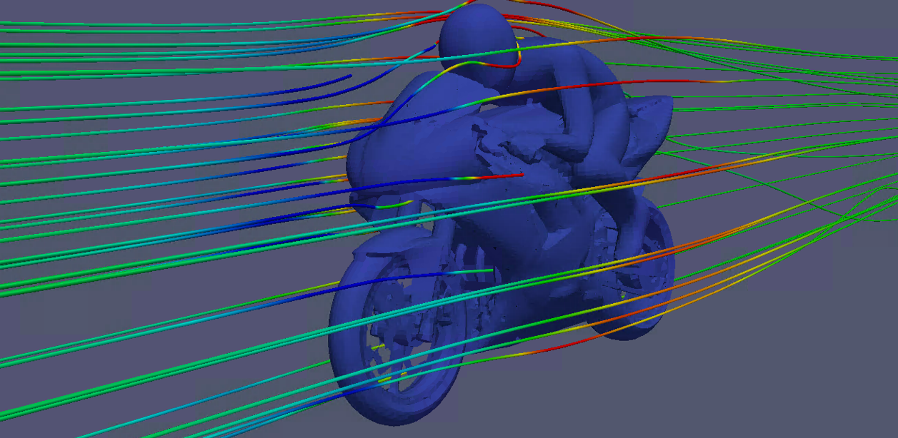
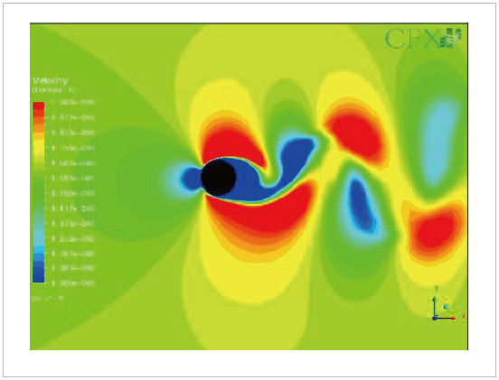
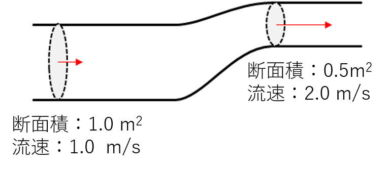
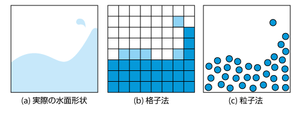
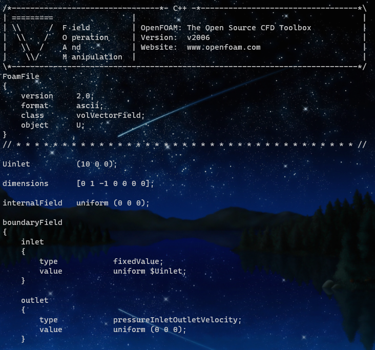

# ビル風の流体解析 ～ドローン集配にむけて～

# 自己紹介
2020年12月1日入社 アルゴリズムチーム
## これまでの経歴
### 2014～2017年：東芝
風力や水力発電に関連する実験・熱流体解析
### 2018～2020年：みずほ情報総研
熱流体・二相流解析に関する技術コンサル

計算力学技術者1級保有

# お断り
- 自分はヤマトグループのドローン配送のプロジェクトには関係なく、内容は自身の経験に基づくものです
- 流体力学のスペシャリストですが、ドローンは専門ではありません
- 導入としてドローンに絡めますが、話のメインは流体解析です

※発表で使われる画像はネットからの引用が多いですが、出典を省略させて頂きます

# 楽天のドローン配送
- これまでに何度か、期間限定でドローンによる配送サービスを実施
- 実施場所は離島や山間部、ゴルフ場など

# 米国のドローン配送
実用化はまだだが、実証実験や法整備などが進んでおり
AmazonやUPS、Wing（Alphabet子会社）がドローン配送の認可を取得している

※イメージ画像

# ヤマトのドローン配送
 ｢eVTOL（イーブイトール）プロジェクト｣
米国ベル社と共同開発

※イメージ画像
https://www.yamato-hd.co.jp/news/h30/h30_62_01news.html

# ドローン配送に対する、流体解析の必要性
- ドローンは強風時には飛ぶことができない
- 風は、地上と上空で強さ・向きが異なる
- ビル群などでは、構造物の影響を受けて、風の強さ・向きが変わる

実際に都市部におけるドローンの安全飛行に向けた気象予測プロジェクトが行われており、有効性が検証されている。

> 新宿でのドローン飛行実証実験に超高解像度「都市乱流予測」を提供
（日本気象協会、防災科研、東京工業大学）
 https://www.titech.ac.jp/news/2019/045851.html

# 流体解析とは？
コンピュータを用いて、ある条件下における流体の挙動をシミュレーションすること

与える条件：
流入条件や流出条件、物体形状など

# 流体力学の問題
下図のパイプの中を、空気が流れています。
左側断面における風速が1.0 m/sの場合の、右側断面における風速を求めよ

# 答え
体積の連続性が成り立つため、断面積比で流速が求まる
※マッハ数0.3以下の時、圧縮性を考慮する必要はない

# 流体の支配方程式
### ナビエストークス方程式（非圧縮）
$$
\frac{\partial u}{\partial t}+u \cdot \nabla u =
− \frac{1}{\rho} \nabla p+ \nu \nabla^2 u
$$
### 連続の式
$$
\nabla \cdot u = 0
$$

これらの式を"離散化"してコンピュータで計算する

# 離散化とは
本来連続的に存在する物理量を、計算しやすいように区切って表現する
手法によって、離散化の方法はいろいろ

# ビル風の解析をしてみよう！
## 使うソフト
OpenFOAM®
オープンソースの流体解析ソフト

## 計算環境
Surface pro6
WSL2 Ubuntu

# 流体解析の流れ
1. 解析対象の形状を用意する
1. 計算メッシュを作成する（離散化した計算ができるように）
1. 境界条件や物性などを設定する
1. 計算する
1. 結果の確認をする

# 計算する

